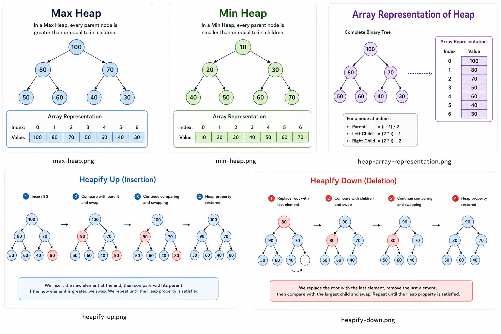

# Heap Data Structure

## Overview



A **Heap** is a specialized tree-based data structure that satisfies the **Heap Property**.

There are two main types:

* **Max Heap** → Parent node is greater than or equal to its children.
* **Min Heap** → Parent node is smaller than or equal to its children.

Common applications include:

* Priority Queues
* Heap Sort
* CPU Scheduling
* Graph Algorithms (Dijkstra & Prim)

---

## Heap Structure

A Heap is a **Complete Binary Tree**, meaning all levels are completely filled except possibly the last level, which is filled from left to right.

### Example of a Max Heap

```text
          100
         /   \
       80     70
      / \    / \
    50  60  40  30
```

### Array Representation

```text
Index: 0   1   2   3   4   5   6
Value:100 80  70  50  60  40  30
```

---

## Parent and Children Relationships

For a node stored at index `i`:

```cpp
Parent      = (i - 1) / 2
Left Child  = (2 * i) + 1
Right Child = (2 * i) + 2
```

Example:

```text
Array = [100, 80, 70, 50, 60, 40, 30]

Node 80 is located at index 1

Left Child  -> index 3 -> 50
Right Child -> index 4 -> 60
```

---

## Insertion Operation

To insert a new value:

1. Add the element at the end.
2. Compare it with its parent.
3. Swap while the Heap Property is violated.

### Before Inserting 90

```text
          100
         /   \
       80     70
      / \    /
    50  60  40
```

### After Insertion

```text
          100
         /   \
       80     70
      / \    / \
    50  60  40  90
```

### Heapify Up

```text
          100
         /   \
       90     70
      / \    / \
    50  60  40  80
```

The inserted element moves upward until the Heap Property is restored.

Time Complexity:

```text
O(log n)
```

---

## Deletion Operation

Deleting the root element:

1. Replace the root with the last element.
2. Remove the last element.
3. Restore the Heap Property.

### Before Deletion

```text
          100
         /   \
       90     70
      / \    / \
    50  60  40  80
```

### Move Last Element to Root

```text
          80
         /   \
       90     70
      / \    /
    50  60  40
```

### Heapify Down

```text
          90
         /   \
       80     70
      / \    /
    50  60  40
```

The root moves downward until the Heap Property is satisfied.

Time Complexity:

```text
O(log n)
```

---

## Heapify

Heapify is the process of restoring the Heap Property.

### Heapify Up

Used after insertion.

```text
New Node
    │
    ▼
Compare With Parent
    │
    ▼
Swap If Needed
    │
    ▼
Continue Upward
```

### Heapify Down

Used after deletion.

```text
Root Node
    │
    ▼
Compare With Children
    │
    ▼
Swap With Largest Child
    │
    ▼
Continue Downward
```

---

## Max Heap vs Min Heap

### Max Heap

```text
Parent >= Children
```

Example:

```text
          100
         /   \
       80     70
```

### Min Heap

```text
Parent <= Children
```

Example:

```text
           10
         /    \
       20      30
```

---

## Time Complexity

| Operation   | Complexity |
| ----------- | ---------- |
| Insert      | O(log n)   |
| Delete Root | O(log n)   |
| Heapify     | O(log n)   |
| Peek        | O(1)       |
| Build Heap  | O(n)       |
| Search      | O(n)       |

---

## Applications

### Priority Queue

```text
Priority 5 → Process First
Priority 4
Priority 3
Priority 2
Priority 1
```

The highest-priority element is processed first.

### CPU Scheduling

```text
High Priority Process
          ↓
     Executed First
```

### Dijkstra's Algorithm

```text
Closest Node
      ↓
 Selected Next
```

Heap allows efficient selection of the next minimum-distance node.

### Heap Sort

```text
Build Heap
     ↓
Extract Root
     ↓
Heapify
     ↓
Repeat
```

Time Complexity:

```text
O(n log n)
```

---

## Complexity Analysis Summary

| Operation   | Time Complexity | Space Complexity |
| ----------- | --------------- | ---------------- |
| Insert      | O(log n)        | O(1)             |
| Delete Root | O(log n)        | O(1)             |
| Peek        | O(1)            | O(1)             |
| Search      | O(n)            | O(1)             |
| Build Heap  | O(n)            | O(1)             |

---

## My Implementation

This implementation was developed as part of my **Data Structures Journey** project.

### Features Implemented

* Max Heap
* Insert
* Extract Max
* Heapify Up
* Heapify Down
* Build Heap
* Priority Queue Applications

### Concepts Learned

* Complete Binary Trees
* Heap Property
* Array-Based Tree Representation
* Priority Queues
* Heap Sort Fundamentals

---

## References

* Introduction to Algorithms (CLRS)
* Data Structures & Algorithms Courses
* Academic Notes and Documentation
